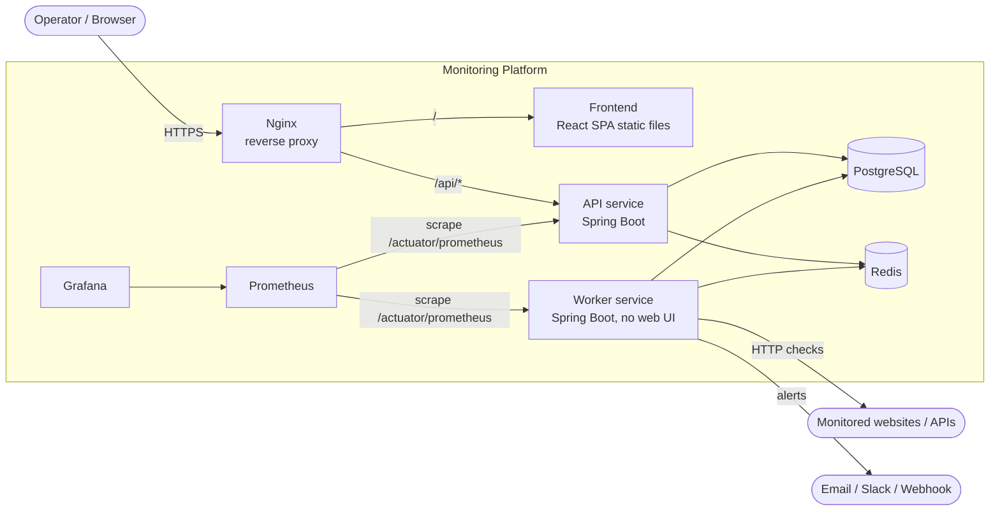
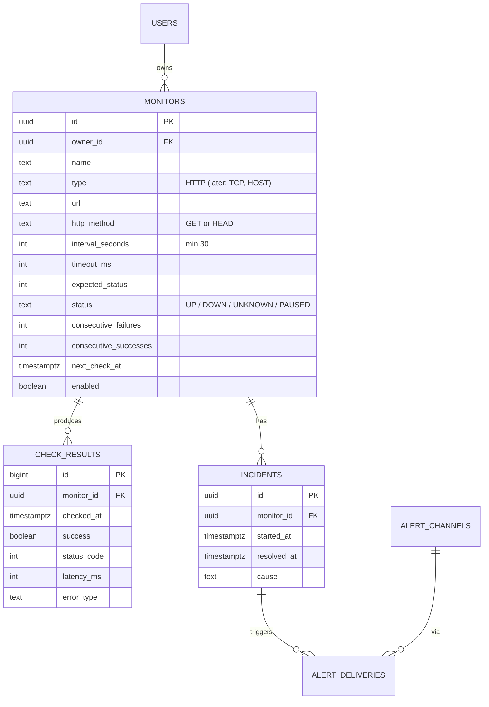

# Architecture

This document describes the target architecture of the platform. It is the reference
for all implementation phases; when an implementation decision diverges from it, this
document is updated in the same change.

## 1. Goals and non-goals

**Goals**

- Monitor HTTP(S) websites and APIs on a per-target interval (Linux hosts later).
- Record every check result (status, latency, error) as history.
- Detect incidents (target down / degraded) and resolve them automatically.
- Alert on incident open/resolve through pluggable channels.
- Expose operational metrics to Prometheus and dashboards in Grafana.
- Run locally with Docker Compose; stay portable to Kubernetes and AWS.

**Non-goals (for now)**

- Multi-region probing, synthetic browser checks, log aggregation, multi-tenancy.
- Executing user-provided scripts or shell commands — this is never supported.

## 2. System context



## 3. Components

| Component | Responsibility | Scales by | Talks to |
|-----------|----------------|-----------|----------|
| **frontend** | React + TypeScript + Vite SPA. Pure static assets, no secrets. | CDN / Nginx replicas | API over REST (`/api/v1/...`) |
| **api** | REST API: auth, monitor CRUD, history, incidents, alert channel config. Input validation. Stateless. | Horizontal replicas | PostgreSQL, Redis |
| **worker** | Schedules and executes checks, writes results, runs incident detection, dispatches alerts. Has no public HTTP endpoints — only an internal management port for health and metrics. | Horizontal replicas (see §5) | PostgreSQL, Redis, external targets, notification providers |
| **postgresql** | System of record: users, monitors, check results, incidents, alert config. | Vertical, later managed (RDS) | — |
| **redis** | Alert event stream, short-lived caches, rate-limit counters. **Not** a source of truth. | Single node, later managed (ElastiCache) | — |
| **prometheus** | Scrapes API and worker metrics. | — | api, worker |
| **grafana** | Dashboards on Prometheus data (provisioned as code). | — | Prometheus |
| **nginx** | TLS termination, serves the SPA, proxies `/api`, security headers, request size limits. | — | frontend, api |

**Why the API and worker are separate services:** checks must keep running when nobody
has the UI open, and when the API is being redeployed. A slow or hung target must never
use up the API's request threads. Each service can also be scaled and resourced on its own.
In Kubernetes they become two Deployments sharing one database.

## 4. Repository layout

A monorepo keeps one version history and one CI pipeline for a portfolio project. Each
service still builds to its own container image.

```text
monitoring/
├── backend/                  # Maven multi-module build (Phase 2+)
│   ├── pom.xml               # parent POM: versions, plugins
│   ├── common/               # shared domain: entities, repositories, DTOs, Flyway migrations
│   ├── api/                  # Spring Boot REST API  -> image: monitoring-api
│   └── worker/               # Spring Boot worker    -> image: monitoring-worker
├── frontend/                 # React + TS + Vite (Phase 8)
├── infra/
│   ├── nginx/                # nginx.conf (Phase 15)
│   ├── prometheus/           # prometheus.yml, alert rules (Phase 10)
│   └── grafana/              # provisioning + dashboards JSON (Phase 11)
├── deploy/
│   └── terraform/            # AWS infrastructure (Phase 18)
├── .github/workflows/        # CI/CD (Phase 16)
├── docs/                     # architecture, ADRs, runbooks
├── docker-compose.yml        # local stack (Phase 14; dev DB earlier)
├── .env.example              # documented config, no real secrets
└── README.md
```

Directories are created in the phase that first needs them.

**Shared module rule:** `common` contains only persistence and domain code. It must not
depend on anything in `api` or `worker`. Only one service owns database migrations: the
**api** runs Flyway at startup, and the worker validates the schema (`ddl-auto=validate`)
and never migrates it.

## 5. Check execution design

### 5.1 Scheduling — PostgreSQL is the queue for due checks

Each monitor row stores `next_check_at`. Every worker runs a short polling loop (for example every 1 s):

```sql
SELECT id FROM monitors
WHERE enabled = true AND next_check_at <= now()
ORDER BY next_check_at
LIMIT :batch
FOR UPDATE SKIP LOCKED;
-- then: UPDATE monitors SET next_check_at = now() + interval, ... in the same transaction
```

- `SKIP LOCKED` lets any number of worker replicas share the work, and no check is claimed twice.
- The schedule survives restarts because it lives in the database. Nothing is lost if Redis goes down.
- The claimed checks run on a bounded executor pool (virtual threads if we move to
  Java 21), with a hard per-check timeout.

**As implemented (Phase 5)** in `worker/scheduling`:

- `MonitorClaimRepository` claims in **one statement** (`UPDATE … FROM (SELECT … FOR UPDATE SKIP
  LOCKED) … RETURNING`). Moving `next_check_at` forward at claim time acts as a lease: if a worker
  crashes mid-check, the monitor simply runs at its next interval. The claim uses plain SQL, so it
  never bumps the JPA `version` a user's edit depends on. `Monitor` uses `@DynamicUpdate`, so API
  edits don't overwrite scheduling columns.
- `CheckScheduler` (a `SmartLifecycle`) holds one semaphore permit per pool thread and claims at most
  as many monitors as it has free permits. A busy replica leaves due work for others instead of
  queueing it. On shutdown it stops claiming, waits `WORKER_SHUTDOWN_GRACE` for in-flight checks,
  then interrupts them.
- Health: **liveness** includes `checkScheduler`, which is DOWN only if the polling loop stops making
  progress. **Readiness** includes the DB. A database outage turns the worker unready and makes it
  log retries, but never triggers restarts.
- The worker validates the schema and never migrates it (`spring.flyway.enabled=false`). Start
  the API first on a fresh database.

Redis Streams were considered as the job queue. They were rejected for scheduling because the
database would still have to decide which checks are due, and a second queue adds
failure modes (lost messages, stuck pending entries) for no gain at this scale.

### 5.2 Check execution

The HTTP check records: final status code, total latency (ms), TLS handshake success,
optional expected status / keyword match, and a classified error (`TIMEOUT`,
`DNS_FAILURE`, `CONNECTION_REFUSED`, `TLS_ERROR`, `UNEXPECTED_STATUS`, `BODY_MISMATCH`).

**As implemented (Phase 6)** in `worker/check`:

- `HttpChecker` uses Apache HttpClient 5 with a `GuardedDnsResolver`. The client connects **only**
  to addresses that resolver returns, and the resolver rejects the host if any address is blocked.
  The SSRF policy therefore applies to every connection, including each redirect hop, IP-literal
  hosts, and a DNS answer that changed after the monitor was saved (rebinding).
- **Latency** runs from just before sending the request to the end of reading the body. It covers a
  fresh DNS + TCP + TLS + request each time, because connections are never reused.
- **Limits:** a hard deadline equal to `timeoutMs` cancels the request in any phase (connect,
  headers or slow-drip body). Redirects are capped at 5, circular redirects rejected, at most 1 MB of
  body read. No retries, cookies, auth or system proxies.
- **Success:** the status equals `expectedStatus`, or any 2xx/3xx if none is set. `BODY_MISMATCH` is
  reserved for a future keyword check.
- `CheckResultRecorder` writes the `check_results` row and advances `monitors.last_checked_at` (only
  ever forward) in one transaction, without bumping the JPA version. If the monitor was deleted
  mid-check, the result is discarded. If the database is down, the result is dropped and logged.

### 5.3 Incident detection — a per-monitor state machine

```text
UP --(N consecutive failures)--> DOWN     => open incident, emit INCIDENT_OPENED
DOWN --(M consecutive successes)--> UP    => resolve incident, emit INCIDENT_RESOLVED
```

- N and M are per-monitor settings (defaults 3 and 2). They prevent flapping and false alarms from a single dropped packet.
- The state change and the incident row are written in the **same transaction** as the
  check result, so the state is always consistent.
- The API can later add a `DEGRADED` state (latency threshold) without changing the model.

**As implemented (Phase 7):**

- The rules are a pure function (`worker/incident/IncidentStateMachine`). `CheckResultRecorder` applies
  it in one transaction: insert result → `SELECT … FOR UPDATE` the monitor row → update status and
  counters → open or resolve the incident. The API takes the same row lock when it edits a monitor,
  so the two never interleave.
- Only the **newest** result changes state. A check that finishes late, or one for a paused monitor,
  is stored as history only.
- `started_at` is the time of the *first* failure in the streak ("down since"), and `resolved_at` is
  the *first* success of the recovery streak. They are not the moment the threshold was crossed.
- A second open incident is impossible: the partial unique index enforces it, and the insert uses
  `ON CONFLICT … DO NOTHING`, so it can never fail the recording transaction.
- `incidents.resolution` records why an incident ended: `RECOVERED`, `MONITOR_PAUSED` (paused
  while down), or `MONITOR_CHANGED` (URL, method, timeout or expected status changed while down).
  Pausing or changing the check also resets the status to `UNKNOWN`. Renaming or changing thresholds
  or the interval does not.
- Known limitation: a check already in flight when the target is changed can still count toward the
  new state once. The effect is at most one result.

### 5.4 Alerting — transactional outbox in PostgreSQL

*(Design change in Phase 12: the original plan used a Redis Stream. The outbox alone gives the
same asynchronous delivery without a second source of truth. Redis is used in Phase 13 for
sessions and rate limiting instead.)*

- When the recorder opens or resolves an incident, it inserts one `alert_deliveries` row per enabled
  channel **in the same transaction**. Either the incident and its alerts commit together, or
  neither does. A unique index on `(incident_id, event_type, channel_id)` makes this idempotent.
- `AlertDispatcher` (worker) claims due rows with `FOR UPDATE SKIP LOCKED` and pushes
  `next_attempt_at` forward as a lease. Failures retry with exponential backoff (30 s … 1 h, 8
  attempts), then the row becomes `FAILED`. Delivery is at-least-once, and receivers can
  de-duplicate on `X-Monitoring-Delivery`.
- **Channels:** generic webhook (HMAC-SHA256 signature over `timestamp.body`, with the secret shown
  once at creation), Slack incoming webhook (text escaped so monitor names cannot trigger
  mentions), and e-mail via SMTP (subjects stripped of line breaks).
- **Security:** channel targets and signing secrets are encrypted at rest with AES-256-GCM
  (`ALERT_ENCRYPTION_KEY`), and the API only ever returns a masked preview. Webhook URLs get the SSRF
  check on save and the guarded DNS resolver on send, with redirects disabled. Slack targets must
  be `https://hooks.slack.com/services/...`.
- Only real recoveries send a "resolved" alert. Incidents closed because a monitor was paused or
  changed do not notify.

## 6. Data model (initial draft)



`check_results` is the high-volume table. It has an index on `(monitor_id, checked_at DESC)` and a
retention job (for example 30 days raw). Monthly partitioning can be added later without API changes.
Its IDs come from a sequence allocated in blocks of 50, so Hibernate can batch inserts.

**History and retention (Phase 9):** statistics are computed in PostgreSQL. `date_bin` produces
fixed buckets (1 min for 1h, 15 min for 24h, 2 h for 7d, 6 h for 30d) and `percentile_cont` gives
p50/p95. Latency covers successful checks only. Empty buckets come back as gaps, not zeros. The
worker's `RetentionJob` deletes results older than `RETENTION_CHECK_RESULTS_DAYS` (default 30) in
5,000-row batches, each in its own short transaction. A `pg_try_advisory_xact_lock` ensures that
only one replica purges at a time.

The schema lives in `backend/common/src/main/resources/db/migration` (Flyway). The database enforces
its own invariants: check constraints on intervals, timeouts and URL scheme, a consistent
success/error pair on each result, and a partial unique index that allows **at most one open
incident per monitor**. Ownership (`owner_id`, Phase 13) and alerting tables (Phase 12) arrive
as later migrations; existing migrations are never edited.

## 7. API conventions

- Base path `/api/v1`. JSON only. Resource-oriented: `/monitors`, `/monitors/{id}/checks`,
  `/incidents`, `/alert-channels`.
- Errors use RFC 9457 Problem Details (`application/problem+json`) with field-level
  validation errors.
- Pagination: `?page=&size=` with a maximum page size and stable sorting.
- Optimistic concurrency: single-resource responses carry `ETag: "<version>"`; a `PUT` with a
  stale `If-Match` returns **412**, and a write that loses a race at commit time returns **409**.
- Unknown JSON fields are rejected (400) rather than silently ignored, so read-only fields such as
  `status` or `id` can never be set by clients.
- Timestamps in UTC as ISO-8601; IDs as UUIDs (not guessable sequential IDs).
- Management endpoints (`/actuator/health`, `/actuator/prometheus`) are served on a
  **separate management port** that is never routed through Nginx.

## 8. Security principles

| Risk | Mitigation |
|------|------------|
| **SSRF** — users submit URLs that the worker fetches | Allow only `http`/`https`; resolve DNS and block loopback, private (RFC 1918), link-local (incl. `169.254.169.254` cloud metadata), CGNAT and IPv6 equivalents; re-check the resolved address at connection time (DNS rebinding) and on every redirect; cap redirects, response body size, timeout. An allow-list mode for internal targets is available as an explicit admin setting. Implemented in `common/net` (`TargetUrlValidator`, `BlockedAddresses`): the API validates on save; the worker must re-check every resolved address before connecting. Setting `MONITORING_ALLOW_PRIVATE_TARGETS=true` disables the private-address check and logs a warning. |
| Command injection | No shell execution anywhere. Future Linux-host monitoring uses an agent/exporter model (node_exporter), not SSH commands built from user input. |
| Secrets in code | All secrets from environment variables / secret manager; `.env` is git-ignored; `.env.example` holds placeholders only; CI secret scanning. |
| Injection / invalid input | Bean Validation on every DTO; JPA parameter binding only; strict enums; length limits. |
| Auth (Phase 13) | Passwords hashed with BCrypt/Argon2; short-lived JWT access tokens + refresh; rate-limited login; every query scoped by owner. |
| Transport | TLS at Nginx; HSTS, CSP, X-Content-Type-Options, frame-ancestors headers. |
| Containers | Non-root users, minimal base images, pinned versions, read-only FS where possible, image scanning in CI. |
| Abuse | Minimum check interval (30 s), cap on monitors per user, API rate limiting via Redis. |

## 9. Reliability principles

- **Timeouts everywhere:** connect and read timeouts on every outbound call. Nothing blocks without a limit.
- **Graceful degradation:** if Redis is down, checks and incident recording continue and alerts
  are delivered later from the outbox. If the database is down, the worker stops claiming work and
  reports itself unhealthy.
- **Health checks:** Spring Actuator liveness and readiness groups. Readiness includes the DB (and
  Redis for the API). Liveness does not include dependencies, so a database outage doesn't trigger a restart loop.
- **Graceful shutdown:** in-flight checks finish within a grace period, and nothing new is claimed.
- **Idempotency:** alert deliveries are keyed by `(incident_id, event_type, channel_id)`.

## 10. Observability

- **Logs:** structured JSON to stdout (Spring Boot structured logging, ECS format), with a
  correlation/request ID propagated in MDC. Secrets and tokens are never logged.
- **Metrics:** Micrometer → `/actuator/prometheus`. Key worker metrics include check duration histogram,
  checks total by outcome, scheduler lag (`now - next_check_at`), open incidents gauge,
  and alert delivery failures. Per-monitor labels are limited to monitor ID to keep
  cardinality bounded.
- **Dashboards:** Grafana dashboards provisioned from JSON in `infra/grafana`.

## 11. Configuration

Everything is set through environment variables following Spring's relaxed binding, and documented in
`.env.example`. Profiles: `local` (developer machine), `docker` (compose), `prod`.
Configuration never contains a secret default value.

## 12. Deployment path

1. **Local:** Docker Compose runs the whole stack (Phase 14).
2. **CI:** GitHub Actions runs build, unit and integration tests (Testcontainers), and image build and scan (Phase 16).
3. **AWS:** ECS Fargate (API and worker), RDS PostgreSQL, ElastiCache Redis, ALB, S3 and
   CloudFront for the SPA, Secrets Manager. Provisioned with Terraform (Phases 17–18).
4. **Kubernetes-ready:** stateless services, configuration from the environment, health probes, and graceful
   shutdown. Moving to Kubernetes means writing manifests, not changing the application.

## 13. Technology versions (baseline)

| Area | Choice |
|------|--------|
| Java | 17 LTS (installed locally); Java 21 is a drop-in upgrade for virtual threads |
| Framework | Spring Boot 4.1.x (Spring Framework 7), Maven 3.9 via wrapper |
| DB migrations | Flyway |
| Database / cache | PostgreSQL 17, Redis 7 |
| Frontend | React 18+, TypeScript, Vite, TanStack Query, Recharts |
| Testing | JUnit 5, Testcontainers, Vitest |
